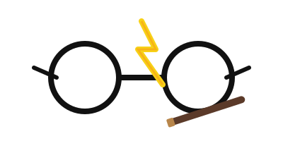

  

<h1 align="center">Hola! 👋 Soy Oscar Guevara</h1>
<h3 align="center">Estudiante de Ing. de Software | Desarrollador Frontend | Entusiasta UX/UI</h3>

 

Soy un desarrollador de software de Ecuador 🇪🇨, actualmente estudiando en la **Universidad Técnica de Ambato**. Mi pasión es crear interfaces de usuario intuitivas y atractivas, combinando el diseño UX/UI con un código frontend limpio y eficiente.

(¡Y sí, la ilustración de arriba es una referencia a que me gusta Harry Potter! ⚡)

 

---

## 🛠️ Tecnologías y Herramientas

Mi stack principal y las tecnologías que estoy explorando:

| Área | Tecnologías |
| :--- | :--- |
| **Frontend** |     |
| **Backend** |  |
| **UX/UI** |  *(familiaridad)* |
| **Aprendiendo** |    |

 

---

## 🚀 Proyectos Destacados

*(¡Asegúrate de añadir los enlaces a tus repositorios cuando estén listos!)*

### 1. Plataforma Estudiantil
* **Descripción:** Proyecto enfocado en la gestión y consulta de información para estudiantes.
* **Tecnologías:** `React`, `Node.js`, `CSS`

### 2. Plataforma de Seguros
* **Descripción:** Sistema para la administración y gestión de pólizas de seguros.
* **Tecnologías:** `React`, `Node.js`, `JavaScript`

 

---

## 🌱 Mis Metas

Actualmente estoy enfocado en mejorar mis habilidades en:
* Arquitecturas de software modernas y escalables.
* Buenas prácticas de desarrollo (Clean Code, SOLID).
* Procesos de despliegue y CI/CD (Docker, Jenkins, GitHub Actions).
* Metodologías de testing (Jest, React Testing Library).

 

---

## 📫 Contacto

Puedes encontrarme en:

* **📧 Email:** [mauriguevara12@gmail.com](mailto:mauriguevara12@gmail.com)
* **📞 Telefono:** 0987714718